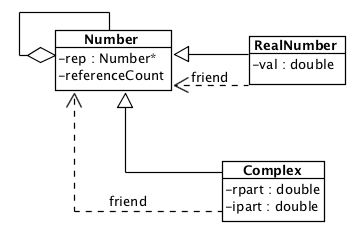

# 代数层次(Algebraic Hierarchy)

##目的
对于联系密切的代数抽象(数值)，通过抽象将它使用通用的接口隐藏起来。

    译注:好奇怪的命名！其本质是指一个实现不同数值表示的案例。其中层次表示一个抽象类与多个具体类的关系。
    即《Advanced C++ Programming Styles and Idioms》中5.5一节所讲述的内容。
    这个惯用法最大的特点就是以组合+继承+引用计数的形式。

##别名
状态 (GOF,设计模式)

##动机
在纯粹的面向对象的语言中，比如Smalltalk，变量可以像是贴标签一样在运行时绑定到对象上。在这些语言中赋值就像是将一个对象的标签撕下来，再贴到另一个对象上。在C/C++里，变量则是等同于对象的地址和偏移量，所以赋值操作就会使用新的值重定。本惯用法使用多态代理(delegated polymorphism)来模拟绑定变量(采用引用计数)到对象，内部实现也使用了Envelope letter惯用法。

最终我们可以写出如下的代码:
```
Number n1 = Complex (1, 2); // Label n1 for a complex number
Number n2 = Real (10); // Label n2 for a real number
Number n3 = n1 + n2; // Result of addition is labelled n3
Number n2 = n3; // Re-labelling
```

##解决方案及示例
完整的实现代码如下:
```
#include <iostream>

using namespace std;

struct BaseConstructor { BaseConstructor(int=0) {} };

class RealNumber;
class Complex;
class Number;

// 表示数值的基类
class Number
{
    friend class RealNumber;
    friend class Complex;

  public:
    Number ();
    Number & operator = (const Number &n);
    Number (const Number &n);
    virtual ~Number();

    virtual Number operator + (Number const &n) const;
    void swap (Number &n) throw ();

    static Number makeReal (double r);
    static Number makeComplex (double rpart, double ipart);

  protected:
    Number (BaseConstructor);

  private:
    void redefine (Number *n);
    virtual Number complexAdd (Number const &n) const;
    virtual Number realAdd (Number const &n) const;

    Number *rep; // 实际数据的表示者
    short referenceCount; // 引用计数管理
};

// 以下是两个具体的数据表示类
class Complex : public Number
{
  friend class RealNumber;
  friend class Number;

  Complex (double d, double e);
  Complex (const Complex &c);
  virtual ~Complex ();

  virtual Number operator + (Number const &n) const;
  virtual Number realAdd (Number const &n) const;
  virtual Number complexAdd (Number const &n) const;

  double rpart, ipart;
};

class RealNumber : public Number
{
  friend class Complex;
  friend class Number;

  RealNumber (double r);
  RealNumber (const RealNumber &r);
  virtual ~RealNumber ();

  virtual Number operator + (Number const &n) const;
  virtual Number realAdd (Number const &n) const;
  virtual Number complexAdd (Number const &n) const;

  double val;
};

/// Used only by the letters.
Number::Number (BaseConstructor)
: rep (0),
  referenceCount (1)
{}

/// Used by user and static factory functions.
Number::Number ()
  : rep (0),
    referenceCount (0)
{}

/// Used by user and static factory functions.
Number::Number (const Number &n)
: rep (n.rep),
  referenceCount (0)
{
  cout << "Constructing a Number using Number::Number\n";
  if (n.rep)
    n.rep->referenceCount++;
}

Number Number::makeReal (double r)
{
  Number n;
  n.redefine (new RealNumber (r));
  return n;
}

Number Number::makeComplex (double rpart, double ipart)
{
  Number n;
  n.redefine (new Complex (rpart, ipart));
  return n;
}

Number::~Number()
{
  if (rep && --rep->referenceCount == 0)
    delete rep;
}

Number & Number::operator = (const Number &n)
{
  cout << "Assigning a Number using Number::operator=\n";
  Number temp (n);
  this->swap (temp);
  return *this;
}

void Number::swap (Number &n) throw ()
{
  std::swap (this->rep, n.rep);
}

Number Number::operator + (Number const &n) const
{
  return rep->operator + (n);
}

Number Number::complexAdd (Number const &n) const
{
  return rep->complexAdd (n);
}

Number Number::realAdd (Number const &n) const
{
  return rep->realAdd (n);
}

void Number::redefine (Number *n)
{
  if (rep && --rep->referenceCount == 0)
    delete rep;
  rep = n;
}

Complex::Complex (double d, double e)
  : Number (BaseConstructor()),
    rpart (d),
    ipart (e)
{
  cout << "Constructing a Complex\n";
}

Complex::Complex (const Complex &c)
  : Number (BaseConstructor()),
    rpart (c.rpart),
    ipart (c.ipart)
{
  cout << "Constructing a Complex using Complex::Complex\n";
}

Complex::~Complex()
{
  cout << "Inside Complex::~Complex()\n";
}

Number Complex::operator + (Number const &n) const
{
  return n.complexAdd (*this);
}

Number Complex::realAdd (Number const &n) const
{
  cout << "Complex::realAdd\n";
  RealNumber const *rn = dynamic_cast <RealNumber const *> (&n);
  return Number::makeComplex (this->rpart + rn->val,
                              this->ipart);
}

Number Complex::complexAdd (Number const &n) const
{
  cout << "Complex::complexAdd\n";
  Complex const *cn = dynamic_cast <Complex const *> (&n);
  return Number::makeComplex (this->rpart + cn->rpart,
                              this->ipart + cn->ipart);
}

RealNumber::RealNumber (double r)
  : Number (BaseConstructor()),
    val (r)
{
  cout << "Constructing a RealNumber\n";
}

RealNumber::RealNumber (const RealNumber &r)
  : Number (BaseConstructor()),
    val (r.val)
{
  cout << "Constructing a RealNumber using RealNumber::RealNumber\n";
}

RealNumber::~RealNumber()
{
  cout << "Inside RealNumber::~RealNumber()\n";
}

Number RealNumber::operator + (Number const &n) const
{
  return n.realAdd (*this);
}

Number RealNumber::realAdd (Number const &n) const
{
  cout << "RealNumber::realAdd\n";
  RealNumber const *rn = dynamic_cast <RealNumber const *> (&n);
  return Number::makeReal (this->val + rn->val);
}

Number RealNumber::complexAdd (Number const &n) const
{
  cout << "RealNumber::complexAdd\n";
  Complex const *cn = dynamic_cast <Complex const *> (&n);
  return Number::makeComplex (this->val + cn->rpart, cn->ipart);
}
namespace std
{
template <>
void swap (Number & n1, Number & n2)
{
  n1.swap (n2);
}
}
int main (void)
{
  Number n1 = Number::makeComplex (1, 2);
  Number n2 = Number::makeReal (10);
  Number n3 = n1 + n2;
  cout << "Finished\n";

  return 0;
}
```
类图:


##已知的应用


##相关的惯用法
* Handle Body
* Envelope Letter

##参考
* Advanced C++ Programming Styles and Idioms，5.5
* 中文版本是 《Advanced C++中文版》

