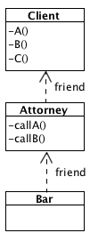
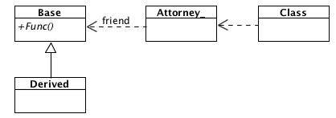

# 律师与委托人 (Attorney-Client)
##目的
控制访问类实现细节的粒度。

##别名

##动机
C++中的friend会开始类内部的所有细节，也因此破坏了封装性。C++没有提供可以选择性使用某一部分私有成员的方式，要么全部开放，要么全部拒绝。例如下面例子中的类Foo声明Bar为其友元，可以访问它的所有私有成员。这样增加了耦合性，类Bar也无法单独发布，这样并不太合适。

```
class Foo
{
private:
  void A(int a);
  void B(float b);
  void C(double c);
  friend class Bar;
};

class Bar {
// 这个类只需要使用Foo::A和Foo::B.
// 但它其实可以访问Foo所有的成员.
};
```
如果能选择确定需要使用到的一组成员，而不是全部，就可以降低耦合性。而这个律师与委托人的惯用法就可以精准的控制友元所能使用的成员。

##解决方案及示例
基本思路是增加一个中间层进行控制。一个客户类可以指定一个律师(Attorney)类作为其友元类，再由此律师类担当其它类使用客户类的代理。与典型的代理(proxy)类不同的是，律师类会限制一个可以使用的成员子集。比如上面的例子中，将Foo改为Client, 再提供一个中间类限制只允许访问Client::A和Client::B。代码如下:
```
class Client
{
private:
  void A(int a);
  void B(float b);
  void C(double c);
  friend class Attorney;  // 这里指定友元类
};

class Attorney {
private:
  static void callA(Client & c, int a) {
    c.A(a);
  }
  static void callB(Client & c, float b) {
    c.B(b);
  }
  friend class Bar;
};

class Bar {
// 现在Bar通过Attorney类就只能使用Client::A和Client::B了。
};
```
类图如下:

 

Attorney类只有私有的inline static函数，每个都持有一个Client实例的引用，再转而调用合适的方法。仅保持私有实现，可以避免被其它类使用。所有需要使用Client都要在Attorney中声明为友元类。如果没有Attorney类，就需要直接修改Client类。

另外还可以使用多个律师(Attorney)类分离出对不同私有实现的访问。

还有一个有趣的案例是提供一个律师(Attorney)类作为多个类的中间人(mediator)，来统一提供对它们私有实现的访问。这个设计可以用于解决C++中无法继承友元类所带来的问题，因为私有实现的虚函数是可以被基类调用的。 下面这个例子里，Derived::Func是一个多态实现。通过这个惯用法同样可以使用到Derived中的私有实现。
```
#include <cstdio>

class Base {
private:
  virtual void Func(int x) = 0;
  friend class Attorney;
public:
  virtual ~Base() {}
};

class Derived : public Base {
private:
  virtual void Func(int x)  {
    printf("Derived::Func\n"); // 虽然没有继承基类中的友元关系，但仍然可以被访问。
  }

public:
  ~Derived() {}
};

class Attorney {
private:
  static void callFunc(Base & b, int x) {
    return b.Func(x);
  }
  friend int main (void);
};

int main(void) {
  Derived d;
  Attorney::callFunc(d, 10);
}
```
类图如下:

 

##已知的应用
* [Boost.Iterators库](http://www.boost.org/doc/libs/1_50_0/libs/iterator/doc/iterator_facade.html#iterator-core-access)
* [Boost.Serialization: class boost::serialization::access](http://www.boost.org/doc/libs/1_50_0/libs/serialization/doc/serialization.html#member)

##相关的惯用法

##参考
* [Friendship and the Attorney-Client Idiom (Dr. Dobb's Journal)](http://drdobbs.com/184402053)
